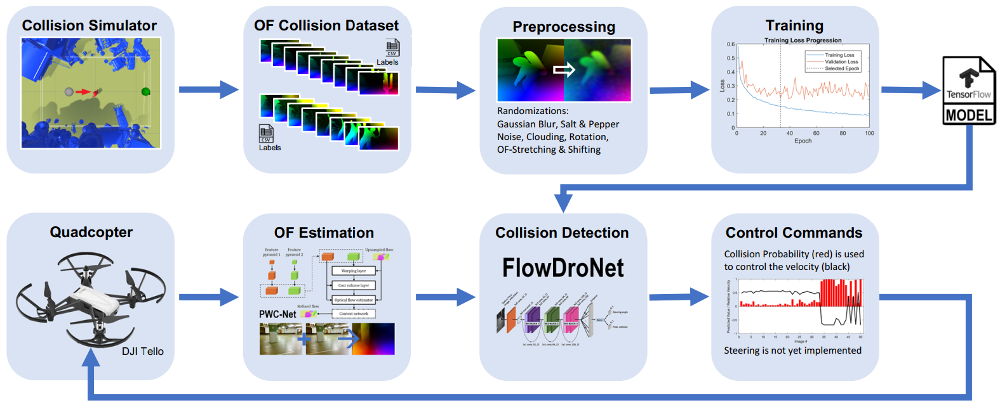
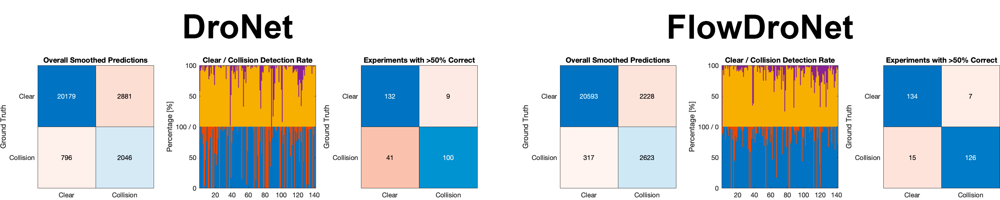
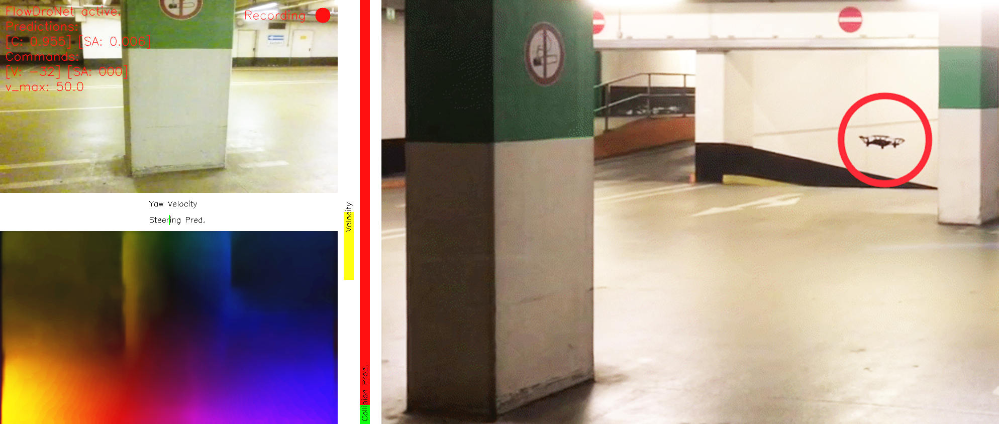

# Domain Generalization via Optical Flow: #
### Training a CNN in a Low-Quality Simulation to Detect Obstacles in the Real World ###

This repository contains the code and links to the datasets and models used for our paper, presented at CRV 2020: [[Paper on IEEExplore]](https://ieeexplore.ieee.org/document/9108671) [[Presentation on YouTube]](https://www.youtube.com/watch?v=Ig6go4ao9ks&feature=youtu.be)


### Table of Contents ###
- [Introduction](#introduction)
	+ [Abstract](#abstract)
	+ [Citing](#citing)
- [Running the Programs](#running-the-programs)
	+ [Dependencies and Installation](#dependencies-and-installation)
	+ [Generate a Dataset](#generate-a-dataset)
	+ [Prepare the Dataset](#prepare-the-dataset)
	+ [Train a Network](#train-a-network)
	+ [Evaluate the Models](#evaluate-the-models)
	+ [Test with a Quadcopter](#test-with-a-quadcopter)
		* [Suggestions for Usage](#suggestions-for-usage)
		* [Controls](#controls)
- [Misc](#misc)
	+ [Other Tools](#other-tools)
	+ [Steering](#steering)
	+ [References](#references)
	+ [Acknowledgements](#acknowledgements)

## Introduction ##


Figure 1: Simplified flowchart of the process of training and using a CNN with artificial optical flow (OF) for collision avoidance.

### Abstract ###

Machine learning techniques have become established tools in the field of computer vision. They have been successfully used for obstacle avoidance, and they are very likely to be implemented in related real-world applications in the future. Since one of the big cost and time factors in machine learning is the production of datasets, using a simulator to generate data provides a cost-effective and flexible alternative to capturing real data. However, the use of a simulator only makes sense if the neural network is able to generalize from simulated to real-world data.

While some techniques for this step, called “Domain Generalization”, work in specific scenarios, most of them still struggle with the complexity of natural and urban environments. In order to reduce the complexity, a method is proposed in which optical flow is used as an intermediate step for generalization. Since optical flow represents projected velocities in the camera's image caused by movements between two images, there are no textures, light effects, or colors present in the optical flow. This greatly reduces the complexity and therefore it is assumend, that these properties could be helpful for generalization.

To evaluate this assumption, a collision avoidance system that uses a convolutional neural network to detect impending collisions was trained with artificial optical flow from a simulator. The simulator generates simple collision scenarios, in which a camera crashes into random objects. Similar collision data was recorded in real-world experiments and then used to test the ability of the network to generalize from simulated to real-world data. In order to assess the performance of the newly trained network, it was compared to the original work, called *DroNet* [[1]](#references), that was trained on a comparable dataset of real-world collisions. The network trained with artifical optical flow, called *FlowDroNet*, was able to detect the collisions of the new dataset more reliable than the network that was trained on a dataset with real-world data. By outperforming *DroNet*'s ability to generalize from real-to-real, it was shown that optical flow can be a helpful tool for simulation-to-real generalization. For a comparison video of the predictions and Grad-CAMs of both networks on the new dataset see [[Youtube](https://www.youtube.com/watch?v=ZpE--Q7n4sI)].


Figure 2: The charts show the results of the evaluation of *DroNet* and *FlowDroNet* on the new real-world collision dataset.


The following flight tests with the system have shown that some of the optical flow characteristics can lead to complications and therefore need to be carefully considered for the intended use. However, since the real-world tests were mostly successful it is demonstrated that *FlowDroNet* can operate under real-world conditions, which reinforces the assumption that optical flow is a useful tool for generalization. For an example video of a test flight see [[YouTube](https://www.youtube.com/watch?v=3Si6SKx_Cas)].


Figure 3: The HUD of the FlowDroNet implementation for testing consists of the two images on the left, together with the prediction and velocity bars. The image on the right shows the external view of the experiment. All images are taken at the moment when the impending collision was detected and the drone was stopped.

### Citing ###

Please use the following bibtex data for citation:
```
@INPROCEEDINGS{9108671,
	author={M. {Sperling} and Y. {Bouteiller} and R. {de Azambuja} and G. {Beltrame}},
    booktitle={2020 17th Conference on Computer and Robot Vision (CRV)},
    title={Domain Generalization via Optical Flow: Training a CNN in a Low-Quality Simulation to Detect Obstacles in the Real World},
    year={2020},
    volume={},
    number={},
    pages={117-124},
    doi={10.1109/CRV50864.2020.00024},
}
```

## Running the Programs ##

### Dependencies and Installation ###

The software has been tested on *Ubuntu* 18.04 and *Mac OS X* 10.14.6 using *Unity* 2019.2.x and *Python* 3.6. See `requirements.txt` for a complete list of the required *Python* libraries and use the following command to install them:
```
$ pip install -r requirements.txt
```

This toolbox is based on the following implementations:
- DroNet [[1]](#references) ([https://github.com/uzh-rpg/rpg_public_dronet](https://github.com/uzh-rpg/rpg_public_dronet))
- A* Pathfinding ([https://github.com/SebLague/Pathfinding](https://github.com/SebLague/Pathfinding))
- ML-ImageSynthesis ([https://bitbucket.org/Unity-Technologies/ml-imagesynthesis](https://bitbucket.org/Unity-Technologies/ml-imagesynthesis))
- DJI Tello Python Library ([https://github.com/damiafuentes/DJITelloPy](https://github.com/damiafuentes/DJITelloPy))
- tfoptflow ([https://github.com/philferriere/tfoptflow](https://github.com/philferriere/tfoptflow))

### Generate a Dataset ##

The Optical Flow Collision Simulator (OFCS) is located in the `OFCS` directory. Create a new *Unity* project in this subfolder, the relevant files should be imported automatically. Open the scene `/Assets/Scenes/Main.unity` containing the mechanics for creating datasets. The following steps for producing data with the OFCS are displayed in figure below. For a quick first start, select the `Seeker` object (cyan) from the *Hierarchy*. Then enter a valid folder (e.g. `/path/to/OFCS_Output/`) for the output in the respective field of the `Unit` component (green) in the *Inspector*. Click on the *Play* button (red) to start the simulator and thus the production of data. The displayed rendering style (real, optical flow or depth) can be selected via the *Display* dropdown menu (blue) in the *Game* tab. Most of the important parameters are set via the *Inspector* and can be found on the `Seeker` object or the `Camera` attached to it. The relevant parameters are displayed in the sections of the scripts (`Unit` and `ImageSynthesis`), which are components of these objects.


Figure 4: The GUI of Unity with the OFCS running.

### Prepare the Dataset ###

The following steps of the process are all contained in the `workflow` directory, starting with the preparation of the OFCS output for training (`step_01_prep_output.py`). Here, the data is split into seperate experiments, making it compatible to the formats used by DroNet. The image augmentations are applied here as well as invalid data is sorted out. However, for the best possible results, the prepared dataset should be manually inspected for problematic or invalid examples (with the provided script `../misc/inspect_dataset.py`). The following command creates a dataset ready for training from the OFCS output with the default settings:

```
$ python step_01_prep_output.py --input_dir=/path/to/OFCS_Output/ --output_dir=/path/to/new/experiment_root/ --img_mode=rgb
```

The *Python* scripts of the workflow share the same common arguments. Use the `--help` flag for a list with descriptions. Also a settings file can be used with all scripts of the workflow. This file is loaded at the start if a file name is given as an argument, but will also be created or updated after each step. If no settings file name is given, the defaults from `misc/defaults.py` are used. It is advisable to use the default settings and apply changes directly in the script after the defaults and arguments are loaded by the *load_settings_or_use_args* method to insure that everything is initialized correctly.

The `img_mode` argument defines which output from the OFCS is used as well as the number of image channels for the later scripts:

| OFCS Render Mode | img_mode | File Name | Channels | Description |
|------------------|----------|-----------|----------|-------------|
| Real | grayscale | img\_#####.png | 1 | grayscale images (also used by original *DroNet*) |
| Raw Flow | flow | flow\_raw\_#####.bin | 2 | raw flow velocities u and v |
| Raw Flow | flow\_as\_rgb | flow\_raw\_#####.bin | 3 | flow from raw data converted to RGB mode |
| Raw Flow | flow\_as\_mag | flow\_raw\_#####.bin | 1 | flow magnitude from raw data |
| Flow | rgb | flow\_#####.png | 3 | flow in RGB mode directly from the OFCS |
| Depth | depth | depth\_#####.png | 1 | depth images |

### Train a Network ###

The training (`step_02_train.py`) is part of the *Python* workflow and based on the original *DroNet* implementation. Use the following command to train a network with the default parameters and data from the previous step:

```
$ python step_02_train.py --experiment_rootdir=/path/to/new/experiment_root/ --settings_fname=settings.json
```

Set the sub-directories for the model and training/validation data with the `model_dir`, `train_dir` and `val_dir` arguments according to your setup. Besides the image properties (height, width and crop size), the other arguments for this step are: `epochs`, `batch_size` and `log_rate`. Use the flag `restore_model` to resume training, starting with the weights defined with `weights_fname` and `initial_epoch`.

### Evaluate the Models ###

For evaluation, a new collision dataset was recorded in a similar fashion as the original *DroNet* dataset by riding a bicycle through urban environments. It was labeled according to the predictions of the original *DroNet* model where it was obviously working and manually in cases where its prediction was clearly incorrect. The dataset was recorded in Brühl, Germany and Montréal, Canada and contains around 26.000 examples in 141 experiments. The dataset was converted to optical flow using *LiteFlowNet* [[2]](#references) for evaluating *FlowDroNet*.


Figure 5: Examples from the new collision dataset with their converted counterparts. The non-collison data is labeled green, the collisions in red.

The datasets can be downloaded from the links provided.

| Type | Resolution/Channels | Description | Download Link |
|------|---------------------|-------------|---------------|
| Real | 720 x 480 x 3 | RGB camera frames | [collision_new_rgb.tar.gz](http://nfinitedesign.de/data/collision_new_rgb.tar.gz) |
| Flow | 448 x 256 x 3 | Converted to OF (in RGB mode) with *LiteFlowNet* [[2]](#references) |[collision_new_liteflownet.tar.gz](http://nfinitedesign.de/data/collision_new_liteflownet.tar.gz) |

To evaluate the training progress and performance of the model over all epochs use the script `step_03_evaluate_all.py`. Use the `test_dir` argument to provide the folder that contains the dataset for testing. The following command produces the evaluation data for the models in the folder `model_123` on the test dataset in `path/to/test_dataset` using the settings from `settings.json`:

```
$ python step_03_evaluate_all.py --experiment_rootdir=/path/to/new/experiment_root/ --settings_fname=settings.json --model_dir=model_123 --test_dir=/path/to/test_dataset
```

The data produced by the previous command can be visualized and inspected with the *Matlab* script `step_04_plot_eval.m`. This script plots the evaluation data in three levels of detail: all epochs, a single epoch and a single experiment of the current epoch. Use the dropdown widgets to choose the epoch and experiment. For selecting the best epoch, the formula `Score = % of True Positives - % of False Positives` is used. Set `folder` to the folder produced by the previous step, e.g. `/experiment_rootdir/eval/eval_123_test_dataset/`.

To inspect a model further run the script `step_05_evaluate_adv.py`. This produces evaluation data for comparison and (if desired) the Grad-CAMs [[3]](#references) for the predictions of a model on a dataset. The Grad-CAMs are produced with *keras-vis* and stored in individual folders for each experiment subfolder. The following command produces the Grad-CAMs for the model of epoch 42 on the test dataset:

```
$ python step_05_evaluate_adv.py --experiment_rootdir=/path/to/new/experiment_root/ --settings_fname=settings.json --test_dir=/path/to/test_dataset --weights_fname=model_weights_42.h5 --show_activations=True
```

The `show_activations` argument is used to switch the Grad-CAMs on or off. Keep in mind that rendering Grad-CAMs for a large dataset might take a while.

For comparing two models use the *Matlab* script `step_06_plot_comparison.m` and set `input_real` and `input_flow` to the folders of the output of the previous script. The script is inteded to compare a *DroNet* to a *FlowDroNet* model but can also be used to compare two flow models.

### Test with a Quadcopter ###

For testing *FlowDroNet* under real-world conditions a control program for the *DJI Tello* quadcopter was developed. In the folder `DroNeTello` you can find both the implementation for regular *DroNet* and for *FlowDroNet*. The *FlowDroNeTello* implementation contains an end-to-end solution, with integrated optical flow estimation. Therefore, *DroNet* was integrated into the unoffical *TensorFlow* conversion of *PWC-Net* [[4]](#references) ([tfoptflow by Phil Ferriere](https://github.com/philferriere/tfoptflow)). The *Python* implementation for the *Tello* ([DJITelloPy by Damia Fuentes](https://github.com/damiafuentes/DJITelloPy)) is used to control the quadcopter with the commands from *DroNet*/*FlowDroNet*.

We provide some trained models to download for testing. The recommended model for using *FlowDroNeTello* is the **FlowDroNet (Current)** model, as the best model is incompatible.  The other models are provided for comparison and completeness:

| Model | Coll./Clear Accurracy | Resolution / Channels | Steering | Description | Download Link |
|-------|-----------------------|-----------------------|----------|-------------|---------|
| DroNet (Original) | 72.0% 87.5% | 200 x 200 x 1 | X | Provided by the authors of *DroNet* [[1]](#references) | [DroNet\_original.rar](http://nfinitedesign.de/data/DroNet_original.rar) |
| DroNet (Fine-Tuned) | 96.0% 98.1% | 200 x 200 x 1 | | Retrained on the original *DroNet* [[1]](#references) dataset and the new collision dataset | [DroNet\_finetuned.rar](http://nfinitedesign.de/data/DroNet_finetuned.rar) |
| **FlowDroNet (Current)** | 87.0% 85.7% | 448 x 256 x 3 | | Trained on a manually inspected and optimized OFCS dataset | [FlowDroNet\_current.rar](http://nfinitedesign.de/data/FlowDroNet_current.rar) |
| FlowDroNet (Best) | 89.2% 90.2% | 200 x 200 x 3 | | Trained on a manually inspected and optimized OFCS dataset | [FlowDroNet\_best.rar](http://nfinitedesign.de/data/FlowDroNet_best.rar) |
| FlowDroNet (Real) | 96.2% 97.7% | 448 x 256 x 3 | | Trained on the *LiteFlowNet* [[2]](#references) conversion of the new collision dataset | [FlowDroNet\_real.rar](http://nfinitedesign.de/data/FlowDroNet_real.rar) |

Models trained with the workflow must be converted from *keras* model to *protobuf* graph. A script for the conversion is provided (`misc/convert_keras_h5_to_pb_graph.py`). Currently *FlowDroNeTello* is setup to only work with an input resolution of 448 x 256 for the *FlowDroNet* model.

#### Suggestions for Usage ####

Before running the programs, setup the paths to the model to be used. The provided model for *PWC-Net* ([Download](http://nfinitedesign.de/data/pwc-net-liteflownet-finetune.rar)) is based on the `pwcnet-sm-6-2-multisteps-chairsthingsmix` model, provided by the authors of [tfoptflow](https://github.com/philferriere/tfoptflow). This model was finetuned on the collision dataset that was converted with *LiteFlowNet* to achieve a better real-world performance. Although the networks optical flow estimation is far worse than *LiteFlowNet's* [[2]](#references), tests have shown that it provides sufficiently stable estimations for this scenario.

To start *DroNeTello* or *FlowDroNeTello* run either one of the following programs after connecting to the *Tello*'s WiFi:

```
$ python DroNeTello.py
```
```
$ python FlowDroNeTello.py
```

Both programs are controlled by keyboard, see the [section below](#controls) for the full list of keyboard commands. While *DroNeTello* is operational right after take-off, *FlowDroNeTello* is depending on movement to create optical flow. Therefore, the drone needs to be moving before *FlowDroNet* should be activated. Otherwise the optical flow estimation is too noisy, thus making *FlowDroNet* predict a collision and stop the drone. Best results can be expected if the quadcopter is flown straight for a couple of meters, until the optical flow estimation has stabilized. Then *FlowDroNet* can be activated and should behave as expected.

**The implementation is not fail-safe, always USE WITH CAUTION and be ready to intervene if something weird happens.**

#### Controls ####

The program is controlled by the keyboard:

| Keys			  | Commands |
|-----------------|----------|
|**Tab** 		  | Takeoff |
|**Shift** 		  | Land |
|**Space**		  | Emergency Shutdown |
|**W,S,A,D**	  | Forward, backward, left and right |
|**Q** and **E**  | Counter clockwise and clockwise rotations |
|**R** and **F**  | Up and down |
|**\#**			  | Arm/Disarm DroNet |
|**O**			  | Show/Hide Optical Flow (FlowDroNeTello only) |
|**C**			  | Start/Stop recording |
|**P**  		  | Cycle through controllable parameters |
|**\+** and **-** | Raise or lower controllable parameter |

When pressing any button (except the ones related to the controllable parameters), *DroNet*/*FlowDroNet* is automatically disarmed and needs to be activated again manually (**\#**).

## Misc ##

### Other Tools ###

Since some of the miscellaneaus scripts (`./misc/*`) are very useful for the workflow, here's a small list of the tools provided:

| Filename | Function |
|----------|----------|
| `auto*.sh` | Shell scripts for automating parts of the workflow |
| `convert_dataset.py` | Applies modifications to a dataset|
| `convert_dataset_liteflownet.py` | Converts a *DroNet* [[1]](#references) dataset to OF with *LiteFlowNet* [[2]](#references), copy to *LiteFlowNet* root directory|
| `convert_keras_h5_to_pb_graph.py` | Converts a keras model (.h5) to a protobuf graph (.pb)|
| `create_eval_video.py` | Uses the output of step 5 of the workflow of two evaluations to create a comparison video|
| `create_exp_sets_from_export.py` | Split a folder of videoframes into multiple experiments |
| `create_labels.py` | Script for manual labeling a dataset from `create_exp_sets_from_export.py` |
| `create_settingsfiles.py` | Creates settings files with different values that can be used for workflow automation |
| `get_flow_stats.py` | Measures the statistics of the optical flow of a dataset in **raw optical flow mode** |
| `eval_flow_stats.m` | Tool for better evaluation of the optical flow statistics |
| `inspect_dataset.py` | Displays a dataset with its labels |
| `show_flow_dataset.py` | Displays an optical flow dataset |
| `vis_epoch_grad_cams.py` | Produces an evaluation video of the *Grad-CAM*s [[3]](#references) of the network's predictions over all epochs of training on a single image |

### Steering ###

Steering angle estimation has been implemented in the OFCS. The mechanics are intended to produce a steering angle upon reaching an obstacle to avoid. However, the provided approach results in a feedback loop, as the network learns to always predict a steering angle when the optical flow indicates rotation. Since no dataset for testing the desired behaviour was available, this work only focuses on the collision detection. The following ideas could be implemented in the future to make it work:

- Centering the optical flow horizontically
- Fake rotations in the OFCS (with 0° steering angle as label)
- Different mechanics for recording the steering angles

Have fun playing with the toolbox ...

### References ###

[1] Antonio Loquercio et al. “DroNet: Learning to Fly by Driving.” [[PDF](http://rpg.ifi.uzh.ch/docs/RAL18_Loquercio.pdf)] [[Website](http://rpg.ifi.uzh.ch/dronet.html)]

[2] Tak-Wai Hui et al. “LiteFlowNet: A Lightweight Convolutional Neural Network for Optical Flow Estimation." [[PDF](https://arxiv.org/pdf/1805.07036.pdf)] [[Website](http://mmlab.ie.cuhk.edu.hk/projects/LiteFlowNet/)]

[3] Ramprasaath R. Selvaraju et al. "Grad-CAM: Why did you say that? Visual Explanations from Deep Networks via Gradient-based Localization." [[PDF](https://arxiv.org/pdf/1610.02391.pdf)] [[Website](http://gradcam.cloudcv.org/)]

[4] Deqing Sun et al. “PWC-Net: CNNs for Optical Flow Using Pyramid, Warping, and Cost Volume.” [[PDF](https://arxiv.org/pdf/1709.02371.pdf)] [[Website](https://research.nvidia.com/publication/2018-02_PWC-Net:-CNNs-for)]

### Acknowledgements ###

A big thanks goes to everyone involved in this project at [MIST Lab](https://mistlab.ca/), especially Prof. Dr. G. Beltrame. Special appreciation is due to the authors of the repositories that were used to realise this toolbox, thanks for the great work!